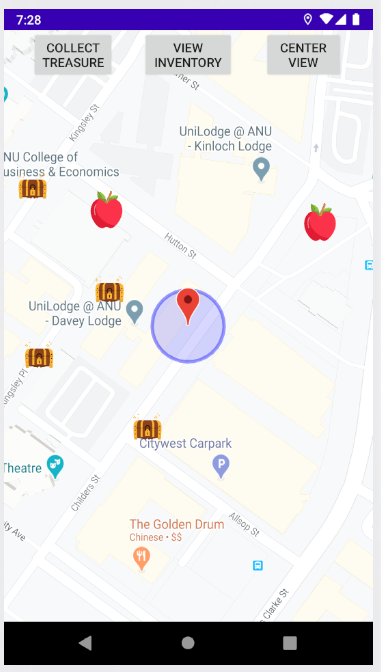

<!--
*** Based on the Best-README-Template: https://github.com/othneildrew/Best-README-Template
***
*** To avoid retyping too much info. Do a search and replace for the following:
*** repo_name, project_title, project_description
-->

<!-- PROJECT SHIELDS -->
<!-- [![Release][release-shield]][release-url] -->
<!-- [![Last Commit][last-commit-shield]][last-commit-url] -->
<!-- [![Contributors][contributors-shield]][contributors-url] -->
<!-- [![Forks][forks-shield]][forks-url] -->
<!-- [![Stargazers][stars-shield]][stars-url] -->
<!-- [![Issues][issues-shield]][issues-url] -->
<!-- [![MIT License][license-shield]][license-url] -->
<!-- [![LinkedIn][linkedin-shield]][linkedin-url] -->

<!-- PROJECT LOGO -->
 

<!--    -->

  <h2 align="center">Java GPS Android Game</h2>

  

    ANU group project - Android app that uses Google Maps API to allows players to use their GPS to find treasure and compete on a leaderboard.
     
    This project was created during my university studies at <b>ANU</b> in <b>2019</b> and has been transferred from the ANU GitLab server.
     
    <b>Group project</b> - see <a href="#acknowledgements">Acknowledgements</a> and code comments for attributions.
     
<!--     <a href="https://github.com/Tim-W-James/repo_name"><strong>Explore the docs »</strong></a>
      
      -->
<!--     ·
    <a href="https://github.com/Tim-W-James/repo_name/issues">Report Bug</a> -->
    <a href="https://github.com/Tim-W-James/Java-GPS-Android-Game/releases">View Demo</a>
<!--     ·
    <a href="https://github.com/Tim-W-James/repo_name/issues">Request Feature</a> -->
  

<!-- TABLE OF CONTENTS -->

  
Table of Contents

  <ol>
    <li>
      <a href="#about-the-project">About The Project</a>
      <ul>
        <li><a href="#features">Features</a></li>
        <li><a href="#built-with">Built With</a></li>
      </ul>
    </li>
    <li>
      <a href="#usage">Usage</a>
      <ul>
        <li><a href="#prerequisites">Prerequisites</a></li>
        <li><a href="#installation">Installation</a></li>
        <li><a href="#how-to-play">How to play</a></li>
        <li><a href="#development">Development</a></li>
      </ul> 
    </li>
<!--     <li><a href="#roadmap">Roadmap</a></li> -->
<!--     <li><a href="#contributing">Contributing</a></li> -->
<!--     <li><a href="#license">License</a></li> -->
    <li><a href="#contact">Contact</a></li>
    <li>
      <a href="#acknowledgements">Acknowledgements</a>
      <ul>
        <li><a href="#group-members">Group members</a></li>
      </ul> 
    </li>
  </ol>

<!-- ABOUT THE PROJECT -->
## About The Project

An Android app that where players can use GPS and search for treasure (similar to Pokemon GO). Includes serverside functionality such as profiles and leaderboards. My primary contributions were creating the game logic, JSON player save data and randomly generated items.

### Features

* GPS functionality with Google Maps API
* Randomly generated treasure with unique properties
* Player data is stored on a Firebase server
* Custom player names and score leaderboard ranking

### Built With

* Java
* Google Maps API
* Firebase
* JSON
* Android Studio

<!-- GETTING STARTED -->
## Usage

### Prerequisites

* Install [Java](https://java.com/en/download/help/download_options.html)
* Install Android SDK and [Android Studio](https://developer.android.com/studio)
* Built for Android 9.0

### Installation

Unfortunately, the Firebase server is no longer active so the app is not usable. Feel free to try the app regardless at <a href="https://github.com/Tim-W-James/Java-GPS-Android-Game/releases">releases</a> or modify the project to be a single player version if you wish.
   
### How to play

Set your username, then enable GPS on your Android device. You will see items appearing on the map nearby - get within the blue circuit and press "collect treasure" to obtain a unique item. You can then view your inventory to see various attributes of that item. You can also view the leaderboard to see how your score compares to others.

### Development

Use Android Studio.

<!-- CONTACT -->
## Contact

Email: [tim.jameswork9800@gmail.com](mailto:tim.jameswork9800@gmail.com "tim.jameswork9800@gmail.com")

Project Link: [https://github.com/Tim-W-James/Java-GPS-Android-Game](https://github.com/Tim-W-James/Java-GPS-Android-Game)

<!-- ACKNOWLEDGEMENTS -->
## Acknowledgements

* Australian National University provided project skeleton

### Group members:

* Nicholas Dale
* Byron Dobner

[product-screenshot]: images/screenshot.png

<!-- USEFUL LINKS FOR MARKDOWN
* https://www.markdownguide.org/basic-syntax
* https://www.webpagefx.com/tools/emoji-cheat-sheet
* https://shields.io
* https://choosealicense.com
* https://pages.github.com
* https://daneden.github.io/animate.css
* https://connoratherton.com/loaders
* https://kenwheeler.github.io/slick
* https://github.com/cferdinandi/smooth-scroll
* http://leafo.net/sticky-kit
* http://jvectormap.com
* https://fontawesome.com -->
